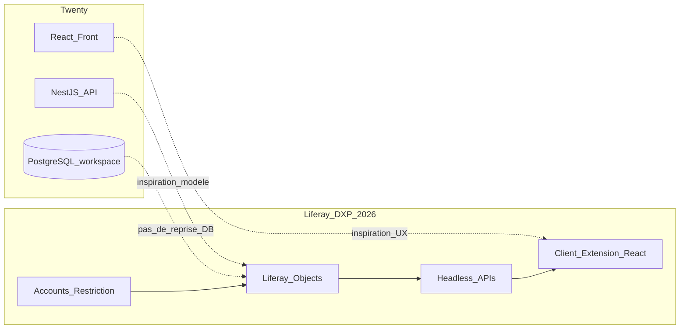
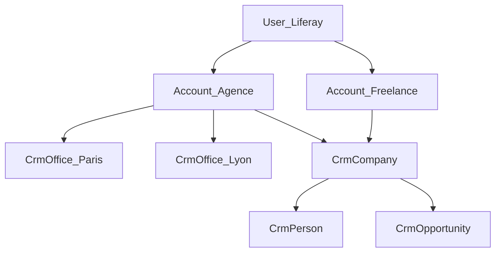

# 02 — Plan de migration technologique (humain)

**De :** Twenty CRM open source ([twentyhq/twenty](https://github.com/twentyhq/twenty))  
**Vers :** Liferay DXP 2026 — brique CRM Amon (phase amont acquisition)  
**Contexte métier :** SaaS Relations Presse, multi-tenant Account Restrictions, Freelance / Agence + bureaux, multi-langue  

Ce document s’adresse aux **chefs de projet, architectes et développeurs humains**.  
Le plan exécutable détaillé pour Cursor AI est dans [03-plan-migration-cursor-ai.md](03-plan-migration-cursor-ai.md).

---

## 1. Intention du portage

On **ne fork pas** Twenty dans Liferay. On **reproduit** :

1. le **modèle de données** cœur (People, Companies, Opportunities, Tasks, Notes) ;
2. les **parcours UX** essentiels (listes, fiches, kanban pipeline) ;
3. les **règles métier** d’acquisition ;

…en s’appuyant sur les **briques natives Liferay** (Accounts, Objects, Account Restriction, Client Extensions, Headless, i18n).

Twenty reste une **référence comportementale** (GitHub + docs), pas une dépendance runtime.

---

## 2. Écarts d’architecture (pourquoi ce n’est pas un lift-and-shift)

| Sujet | Twenty | Liferay Amon |
|-------|--------|--------------|
| Multi-tenant | Workspace isolé (schéma / logique workspace) | **Account** + **Account Restriction** sur Objects |
| Auth | Auth Twenty | Liferay Users / OAuth / SSO |
| API | REST/GraphQL NestJS | Headless Objects + CE |
| UI | App React monorepo | Client Extension React (ou site DXP) |
| Argent | `amountMicros` | Decimal + `currencyCode` |
| Cibles Task/Note | Polymorphes multi-targets | **1 cible** en V1 |
| Bureaux | Absent | **CrmOffice** (Agence RP) |
| Email / AI / Workflows | Natifs | **Hors V1** |

---

## 3. Cible technique Liferay DXP 2026

| Couche | Choix |
|--------|-------|
| Plateforme | Liferay DXP 2026 (build Q correspondant au projet) |
| Données CRM | **Liferay Objects** company-scoped + **Account Restriction** |
| Tenant | Liferay **Accounts** (Business) + custom fields `accountType`, etc. |
| Bureaux | Object `C_CrmOffice` **ou** Account Organizations — **choix retenu : Object `C_CrmOffice`** (plus flexible pour rattacher `officeId` aux fiches CRM) |
| UI | **Client Extension** React (SPA CRM Amon) |
| API | Headless Object APIs (`/o/c/...`) + OAuth2 |
| i18n | Language Keys (`Language.properties` / overrides) + bundles CE (`fr`, `en`) |
| Droits | Account Roles (Admin, Manager, Sales, Viewer) + Regular Role minimal « accès site » |

---

## 4. Phases de migration (roadmap)

### Phase 0 — Cadage & socle (prérequis)

- Valider version exacte DXP 2026 et capacité Objects Account Restriction.
- Créer un **Liferay Workspace** dédié SaaS RP (repo applicatif, pas un repo de test PR).
- Provisionner un site « CRM Amon » + OAuth pour Client Extensions.
- Décider des locales : `fr_FR` (défaut), `en_US`.

**Sortie :** environnement DXP prêt, accès admin, CE « hello » déployé.

### Phase 1 — Modèle multi-tenant & identité

- Configurer Accounts ; custom field `accountType` (`FREELANCE` | `AGENCY`).
- Créer Account Roles CRM.
- Object `C_CrmOffice` + relation Account.
- Règles Freelance vs Agence (spec §15–17).
- Sélecteur d’Account dans le CE.

**Sortie :** un user Agence et un user Freelance isolés, bascule de contexte OK.

### Phase 2 — Objects CRM cœur

Créer et publier, **dans cet ordre** (dépendances) :

1. `C_CrmCompany`
2. `C_CrmPerson` (→ Company)
3. `C_CrmOpportunity` (→ Company, Person)
4. `C_CrmTask`
5. `C_CrmNote`
6. `C_CrmView` (filtres JSON)

Pour **chaque** Object :

- relation obligatoire `r_account` → Account ;
- **Account Restriction** activée ;
- picklists (stages, status, personType) ;
- soft-delete / audit fields ;
- permissions sur Account Roles.

**Sortie :** CRUD Headless testé au Postman/Bruno **par Account** (pas de fuite cross-tenant).

### Phase 3 — UI listes & fiches

- Shell (nav, Account switcher, i18n).
- Listes Companies / People / Opportunities / Tasks.
- Fiches détail + formulaires create/edit.
- Notes sur fiches.

**Sortie :** parcours acquisition manuel bout-en-bout sur 1 Account Agence.

### Phase 4 — Pipeline kanban & vues

- Board kanban + drag & drop (règles WON/LOST).
- Vues sauvegardées (CrmView).
- Accueil compteurs.

**Sortie :** équipe sales peut qualifier un pipeline sans back-office Liferay.

### Phase 5 — Admin tenant & multi-langue

- Écrans Admin Account / Bureaux / Users (CE + APIs Accounts).
- Compléter Language Keys FR/EN.
- Tests bascule langue + fuseau.

**Sortie :** onboarding Freelance et Agence documenté.

### Phase 6 — Durcissement & intégration SaaS RP

- Revue sécurité Account Restriction (pas de Regular Role View global).
- Tests non-régression multi-tenant.
- Exposition Headless pour autres briques du SaaS RP.
- Doc d’exploitation.

**Hors V1 (backlog) :** import CSV, multi-targets Task/Note, email sync, workflows, dashboards, AI.

---

## 5. Mapping détaillé Twenty → Liferay

| Twenty | Portage | Remarque |
|--------|---------|----------|
| `workspace` | Account | Tenant SaaS |
| `workspaceMember` | Account User + Account Role | + `CrmOffice` membership |
| `company` | `C_CrmCompany` | Attention : ≠ Account |
| `person` | `C_CrmPerson` | |
| `opportunity` | `C_CrmOpportunity` | stages Amon figés V1 |
| `task` + `taskTarget` | `C_CrmTask` | 1 cible |
| `note` + `noteTarget` | `C_CrmNote` | 1 cible |
| Views | `C_CrmView` | JSON filtres |
| amountMicros | Decimal | Conversion × 1e-6 si import données Twenty |
| Soft delete `deletedAt` | Object recycle / custom `deleted` | Selon capacités DXP |

---

## 6. Stratégie multi-tenant (Account Restrictions)

**Contrôles à valider à chaque phase :**

1. User Account A ne lit aucune entrée Account B (API + UI).
2. Création sans Account courant → refusée.
3. Changement d’Account en session → listes rechargées à zéro.
4. Account Role Viewer : lecture seule.
5. Regular Role ne doit **pas** exposer les Objects CRM globalement.

---

## 7. Stratégie multi-langue

| Couche | Approche |
|--------|----------|
| Labels UI CE | i18n React (`fr.json` / `en.json`) alignés sur clés `crm-amon.*` |
| Labels Objects / picklists | Localisation Liferay Objects (FR/EN) |
| Login / messages plateforme | Language Override DXP |
| Contenu utilisateur (notes…) | **Non traduit** (données libres) |

---

## 8. Organisation de l’équipe & livrables

| Rôle | Responsabilité |
|------|----------------|
| Architecte Liferay | Objects, Account Restriction, OAuth CE |
| Dev front CE | SPA CRM, kanban, i18n |
| Dev / intégrateur | Account Roles, seed data, tests API |
| Métier RP | Validation pipeline & glossaire (prospect, média…) |
| Cursor AI | Exécution guidée par doc 03 |

**Critères de fin V1 :**

- [ ] 2 tenants (Agence + Freelance) cloisonnés
- [ ] Pipeline kanban opérationnel
- [ ] CRUD Companies / People / Opportunities / Tasks / Notes
- [ ] Admin bureaux (Agence)
- [ ] UI FR et EN
- [ ] Spec § écrans couverts

---

## 9. Risques & mitigations

| Risque | Impact | Mitigation |
|--------|--------|------------|
| Confusion Account vs CrmCompany | Fuite conceptuelle / mauvais modèle | Glossaire imposé ; naming `Crm*` |
| Regular Role trop permissif | Cassage multi-tenant | Checklist sécurité phase 6 |
| Scope creep Twenty (email, AI) | Retard | Périmètre A verrouillé |
| Kanban perf | UX | Pagination par colonne ; virtualisation si besoin |
| DXP 2026 écarts API Objects | Rework | Spike phase 0 sur Account Restriction |

---

## 10. Ce que Cursor doit / ne doit pas faire

**Doit :** suivre [03-plan-migration-cursor-ai.md](03-plan-migration-cursor-ai.md), respecter la spec, commits atomiques, tests de cloisonnement.  
**Ne doit pas :** importer le monorepo Twenty comme dépendance, porter NestJS, implémenter email/AI en V1, affaiblir Account Restriction.

---

*Document humain — à lire avant toute implémentation.*
